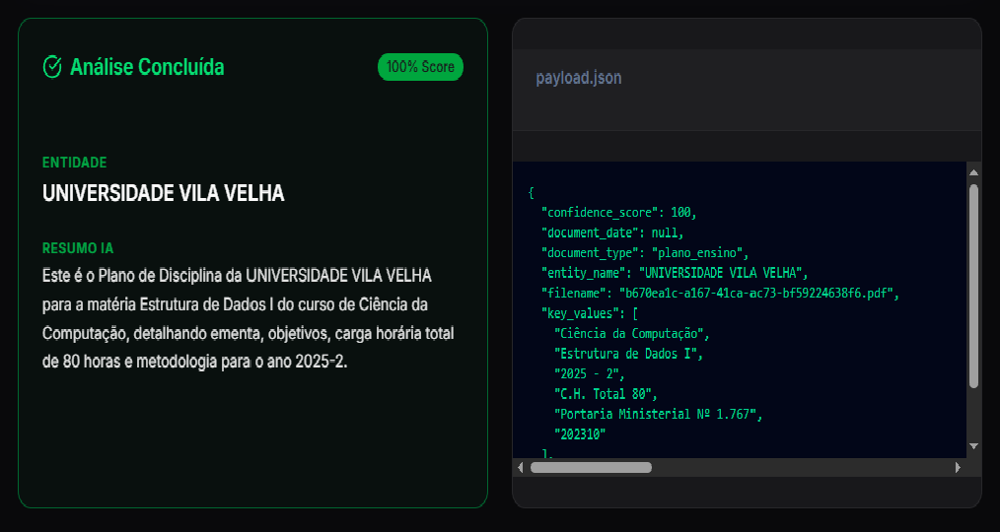
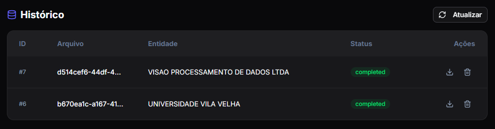

# 📄 DocuFlow Compliance


**DocuFlow Compliance** é uma plataforma avançada de **Engenharia de Dados** e **Extração Inteligente de Documentos (IDP)** projetada para processar, auditar e extrair informações estruturadas de documentos complexos.

O sistema utiliza uma **arquitetura orientada a eventos** para garantir alta resiliência e escalabilidade, orquestrando fluxos de trabalho que combinam OCR tradicional com Modelos de Linguagem de Grande Escala (LLMs) para análise cognitiva.

---

## 📸 Screenshots do Sistema

Aqui está uma visão geral do fluxo de trabalho no DocuFlow.

### 1. Tela Inicial e Upload
A interface limpa permite que os usuários enviem documentos PDF ou imagens para iniciar a análise.


*Interface principal para envio de documentos para a fila de processamento.*

---

### 2. Resultados da Extração com IA
Após o processamento assíncrono pelo Temporal e Gemini, os dados estruturados são apresentados com a pontuação de confiança.


*Visualização dos dados cognitivos extraídos e o JSON bruto gerado pelo modelo.*

---

### 3. Dashboard de Auditoria
A tabela de histórico fornece uma visão completa de todos os documentos processados, com opções para baixar o resultado JSON ou excluir o registro.


*Tabela de gerenciamento de documentos com persistência no PostgreSQL.*

## 🚀 Funcionalidades

- **📥 Ingestão Inteligente:** Upload via Drag-and-Drop com suporte a PDF, PNG e JPG.
- **⚡ Processamento Assíncrono:** Arquitetura baseada em eventos utilizando microsserviços e filas.
- **🔄 Resiliência e Retentativas:** Orquestração de falhas automática via Temporal.io.
- **👁️ OCR + AI:** Combinação de Tesseract (OCR) e Google Gemini Flash (LLM) para extração precisa e estruturada.
- **📊 Monitoramento em Tempo Real:** Polling inteligente no frontend para atualizações de status ao vivo.
- **🗄️ Histórico Auditável:** Dashboard completo com listagem de documentos, status e metadados.
- **💾 Gestão de Dados:** Download dos resultados em JSON e suporte a Soft Delete.

---

## 🏗️ Arquitetura

O sistema segue um fluxo robusto de pipeline de dados:

1.  **Ingestão:** O usuário envia o arquivo via Frontend; a API armazena o arquivo bruto (Raw Data) no **MinIO** (Object Storage).
2.  **Orquestração:** A API inicia um Workflow no **Temporal.io**.
3.  **Processamento (Worker):**
    *   Um Worker Python consome a tarefa.
    *   Executa **OCR** (Tesseract/Poppler) se necessário.
    *   Envia o conteúdo para o **Google Gemini** para extração cognitiva e estruturação.
4.  **Persistência:** O resultado estruturado é salvo no **PostgreSQL**.
5.  **Apresentação:** O Frontend exibe o resultado final e atualiza a tabela de histórico em tempo real.

---

## 🛠️ Stack Tecnológica

### Frontend
- **Framework:** Next.js 14
- **Linguagem:** TypeScript
- **Estilização:** Tailwind CSS & Shadcn/UI
- **Comunicação:** Axios (HTTP Client)

### Backend & Data Engineering
- **API:** Python (FastAPI)
- **ORM & Validação:** SQLAlchemy & Pydantic
- **Orquestração:** Temporal.io
- **AI/LLM:** Google Gemini Flash
- **OCR:** Tesseract & Poppler

### Infraestrutura
- **Banco de Dados:** PostgreSQL
- **Object Storage:** MinIO (S3 Compatible)
- **Containerização:** Docker & Docker Compose

---

## 🏃 Getting Started

Siga as instruções abaixo para executar o projeto localmente.

### Pré-requisitos
- [Docker](https://www.docker.com/) e Docker Compose instalados.
- Uma chave de API do Google Gemini (`GOOGLE_API_KEY`).

### Instalação

1. **Clone o repositório:**
   ```bash
   git clone https://github.com/seu-usuario/docuflow-compliance.git
   cd docuflow-compliance
   ```

2. **Configure as Variáveis de Ambiente:**
   Crie um arquivo `.env` na raiz do projeto (baseado no `.env.example` se disponível) e configure suas credenciais.
   
   ```env
   # Exemplo de configuração
   GOOGLE_API_KEY=sua_chave_aqui
   POSTGRES_USER=user
   POSTGRES_PASSWORD=password
   POSTGRES_DB=docuflow
   MINIO_ACCESS_KEY=minioadmin
   MINIO_SECRET_KEY=minioadmin
   ```

3. **Execute a aplicação:**
   Suba todos os serviços via Docker Compose.
   ```bash
   docker-compose up -d --build
   ```

### Acessando a Aplicação

Uma vez que os containers estejam rodando, você pode acessar:

- **Web App (Frontend):** [http://localhost:3000](http://localhost:3000)
- **API Docs (Swagger):** [http://localhost:8000/docs](http://localhost:8000/docs)
- **Temporal UI (Workflows):** [http://localhost:8081](http://localhost:8081)

---

## 🛡️ Licença

Este projeto é desenvolvido para fins educacionais e de demonstração de arquitetura de software.
